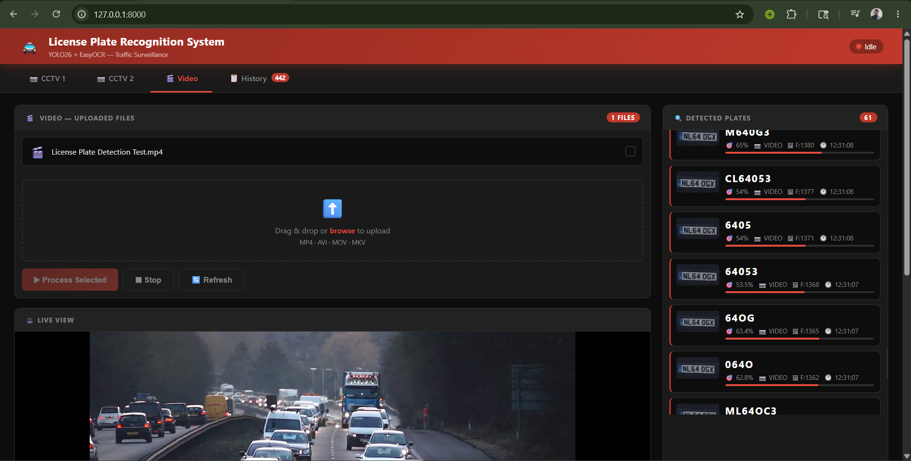
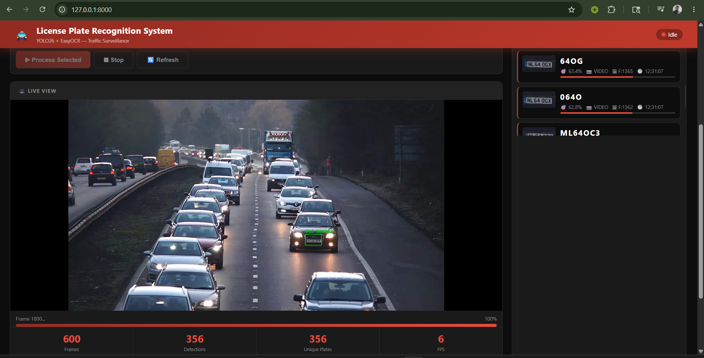
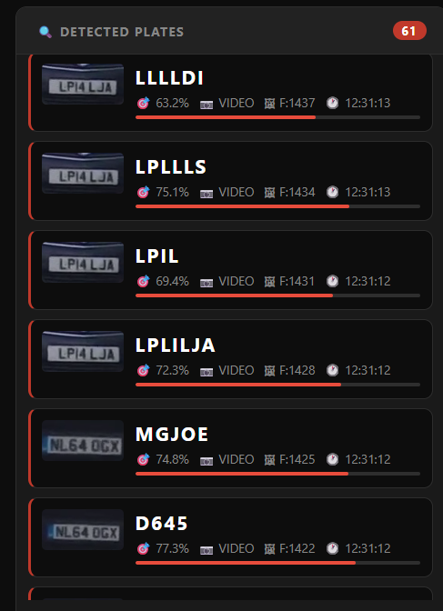
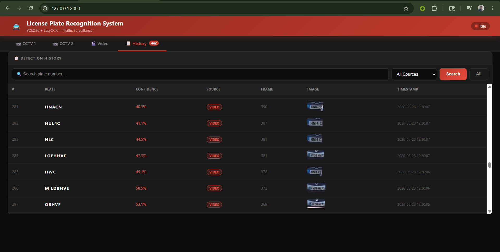
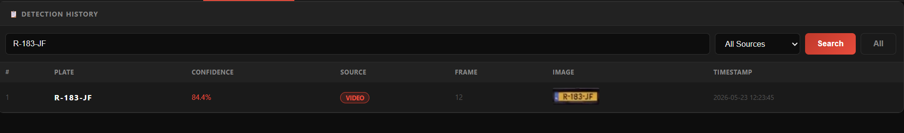

<div align="center">


<br/><br/>

```
  ██╗     ██████╗ ██████╗     ███████╗██╗   ██╗███████╗████████╗███████╗███╗   ███╗
  ██║     ██╔══██╗██╔══██╗    ██╔════╝╚██╗ ██╔╝██╔════╝╚══██╔══╝██╔════╝████╗ ████║
  ██║     ██████╔╝██████╔╝    ███████╗ ╚████╔╝ ███████╗   ██║   █████╗  ██╔████╔██║
  ██║     ██╔═══╝ ██╔══██╗    ╚════██║  ╚██╔╝  ╚════██║   ██║   ██╔══╝  ██║╚██╔╝██║
  ███████╗██║     ██║  ██║    ███████║   ██║   ███████║   ██║   ███████╗██║ ╚═╝ ██║
  ╚══════╝╚═╝     ╚═╝  ╚═╝    ╚══════╝   ╚═╝   ╚══════╝   ╚═╝   ╚══════╝╚═╝     ╚═╝
```

# 🚔 License Plate Detection & Recognition System

### *Real-Time Traffic Surveillance Platform — Powered by YOLO26 + EasyOCR*

<br/>

> **A full-stack web-based license plate detection and recognition system built for traffic surveillance.**
> Upload video footage from multiple CCTV sources, detect license plates in real-time,
> extract text via OCR, and search through the complete detection history — all from a sleek dashboard.

<br/>

[](https://github.com/naimurhamim)
[](#)
[](#license)
[](#)

</div>


## 🎬 Demo Video

<div align="center">

[](https://youtu.be/Rw0dlmQfbv8)

**▶ [Watch Full Demo on YouTube](https://youtu.be/Rw0dlmQfbv8)**

</div>

---

## 📸 Screenshots

---

### 🏠 1. Home Dashboard — CCTV / Video Source



> The **main dashboard** is the first screen you see when the app launches. The top navigation bar contains 4 tabs:
> - **CCTV 1** — Dedicated channel for Camera 1 footage
> - **CCTV 2** — Dedicated channel for Camera 2 footage
> - **Video** — For uploading and processing pre-recorded video files
> - **History** — Full searchable detection log with record count badge
>
> The left panel shows the **video file list** for the selected source, an **upload zone** (drag & drop or browse), and action buttons — **Process Selected**, **Stop**, and **Refresh**. The right panel shows the **Detected Plates** feed. The bottom section shows the **Live View** canvas where the annotated video stream renders in real time.

---

### ▶️ 2. Live Processing — Real-Time Detection in Action



> Once a video is selected and **Process Selected** is clicked, the system connects via **WebSocket** and begins processing the video frame by frame. The live view updates in real time with **green bounding boxes** drawn around every detected license plate.
>
> The bottom stats bar updates continuously:
> - **600** Frames processed
> - **356** Total detections made
> - **356** Unique plates identified
> - **6 FPS** processing speed
>
> A red **progress bar** fills up showing how much of the video has been processed. The status pill in the header switches from `Idle` to `Processing` (green dot) while active.

---

### 🔍 3. Detection Panel — Live Plate Feed



> The right-side **Detected Plates** panel updates in real time as each plate is recognized. Every detection card shows:
> - **Cropped plate thumbnail** — the actual image extracted from the video frame
> - **Plate text** — recognized via EasyOCR (e.g. `LP14 LJA`, `NL64 OGX`)
> - **Confidence %** — YOLO detection confidence score
> - **Source** — which channel (CCTV 1 / CCTV 2 / VIDEO)
> - **Frame number** — which frame the plate was detected in
> - **Timestamp** — exact time of detection
>
> A red **confidence bar** at the bottom of each card gives a visual indicator of detection quality. The badge in the header shows the total count — **61 detections** in this view.

---

### 📋 4. History — Complete Detection Log



> The **Detection History** tab shows a complete table of every plate ever detected across all sessions. The **History** tab badge shows **442** total records accumulated.
>
> Each row contains:
> - **#** — Record index
> - **Plate** — Recognized plate text (bold white)
> - **Confidence** — Detection confidence in red
> - **Source** — Source badge (VIDEO / CCTV1 / CCTV2)
> - **Frame** — Frame number where the plate was found
> - **Image** — Thumbnail of the cropped plate
> - **Timestamp** — Date and time (`2026-05-23 12:30:07`)

---

### 🔎 5. Search — Filter by Plate Number or Source



> The **Search** feature allows instant filtering of detection history. Searching for `R-183-JF` returns exactly **1 result** — detected at **84.4% confidence** from the **VIDEO** source at frame **12** on `2026-05-23 12:23:45`.
>
> The search bar supports partial matches. The **Source dropdown** allows filtering by `All Sources`, `CCTV 1`, `CCTV 2`, or `Video`. The cropped plate thumbnail is shown for visual verification.

---

## ✨ Features

| Feature | Description |
|---|---|
| 🎯 **YOLO26 Detection** | Latest Ultralytics model — NMS-free, 43% faster inference than YOLO11 |
| 🔤 **EasyOCR Recognition** | GPU-accelerated OCR engine for plate text extraction |
| 📷 **Multi-Source Support** | CCTV 1, CCTV 2, and Video tabs — independent file management per source |
| 🎬 **Real-Time Live View** | Annotated WebSocket video stream rendered in the browser |
| 🖼️ **Auto Plate Crop & Save** | Every detected plate cropped and saved as `.jpg` in `output/plates/` |
| 💾 **CSV Detection Log** | All detections saved with plate text, confidence, source, frame, timestamp |
| 🔍 **Search & Filter** | Search by plate number, filter by source channel instantly |
| 📊 **Live Stats Dashboard** | Real-time Frames, Detections, Unique Plates, and FPS counters |
| 🌐 **Web-Based UI** | Dark red themed dashboard — no extra frontend framework required |
| ⚡ **GPU Acceleration** | CUDA-powered inference on NVIDIA GPU |
| 🔄 **Duplicate Filtering** | Same plate seen multiple times per video is deduplicated |

---

## 🛠️ Tech Stack

| Component | Technology |
|---|---|
| Object Detection | YOLO26 (Ultralytics 8.4+) |
| OCR Engine | EasyOCR 1.7 |
| Backend | FastAPI + WebSocket |
| Frontend | HTML5 / CSS3 / Vanilla JS |
| Video Processing | OpenCV 4.10 |
| Data Storage | CSV (no database needed) |
| GPU Support | CUDA 12.1 (NVIDIA) |
| Model Training | Roboflow Dataset + YOLO26 Transfer Learning |

---

## 📁 Project Structure

```
License-Plate-Detection-and-Recognition/
│
├── 📁 models/
│   └── best.pt                      # Trained YOLO26 model
│
├── 📁 uploads/                      # Uploaded input videos
│
├── 📁 output/
│   └── 📁 plates/                   # Cropped plate images
│
├── 📁 data/
│   └── detections.csv               # Complete detection log
│
├── 📁 templates/
│   └── index.html                   # Web dashboard UI
│
├── 📁 screenshots/                  # Project screenshots
│
├── app.py                           # FastAPI backend (main app)
├── train.py                         # YOLO26 training script
├── download_dataset.py              # Roboflow dataset downloader
├── requirements.txt                 # Python dependencies
└── README.md
```

---

## 🚀 Getting Started

### Prerequisites

- Python **3.10+**
- Windows or Linux
- NVIDIA GPU (recommended) with CUDA 12.1+
- Video files (MP4, AVI, MOV, MKV)

### 1. Clone the Repository

```bash
git clone https://github.com/naimurhamim/License-Plate-Detection-and-Recognition.git
cd License-Plate-Detection-and-Recognition
```

### 2. Create Virtual Environment

```bash
python -m venv lpr_env

# Git Bash (Windows)
source lpr_env/Scripts/activate

# PowerShell (Windows)
lpr_env\Scripts\activate
```

### 3. Install PyTorch with CUDA

```bash
# Check your CUDA version first
nvidia-smi

# CUDA 12.1+
pip install torch torchvision torchaudio --index-url https://download.pytorch.org/whl/cu121

# CUDA 11.8
pip install torch torchvision torchaudio --index-url https://download.pytorch.org/whl/cu118
```

### 4. Install Requirements

```bash
pip install -r requirements.txt
```

### 5. Run the App

```bash
python app.py
```

Open browser: **http://localhost:8000** 🚀

---

## 🧠 Model Training

### Download Dataset

```bash
python download_dataset.py
```

**Dataset:** [License Plate Recognition — Roboflow Universe](https://universe.roboflow.com/roboflow-universe-projects/license-plate-recognition-rxg4e)

| Stat | Value |
|---|---|
| Total Images | 24,242 |
| mAP@50 | 97.2% |
| Precision | 100% |
| Recall | 100% |
| Classes | 1 (`License_Plate`) |

### Train with YOLO26

```bash
python train.py
```

> Best model saved at: `runs/lpr_yolo26/weights/best.pt`
> Copy to `models/best.pt` to use in the app.

---

## ⚙️ How It Works

```
Video Upload (MP4 / AVI / MOV / MKV)
        ↓
Frame Extraction — every 3rd frame for speed
        ↓
YOLO26 Detection → Bounding box around license plate
        ↓
Plate Region Crop → saved as .jpg in output/plates/
        ↓
EasyOCR → Extract plate text from cropped image
        ↓
Duplicate Filter → skip if same plate already seen this video
        ↓
CSV Append → plate_text, confidence, source, frame_num, timestamp
        ↓
WebSocket → Send annotated frame + detection data to browser
        ↓
Browser UI → Live view canvas + Detection panel updates
```

---

## 🔧 Configuration

| Parameter | Default | Description |
|---|---|---|
| Detection confidence | `0.4` | Minimum YOLO confidence threshold |
| Frame skip | Every 3rd | Process every 3rd frame for speed |
| OCR language | `en` | EasyOCR language |
| GPU | `True` | Set `gpu=False` in `app.py` for CPU only |
| Server port | `8000` | Change in last line of `app.py` |

---

## 📊 Performance

Tested on **NVIDIA GeForce RTX 3050 Ti Laptop GPU (4GB VRAM)**

| Metric | Value |
|---|---|
| Processing Speed | ~6 FPS |
| YOLO26 mAP@50 | 97.2% |
| Unique plates per video | 300–500+ |
| Detection confidence avg | 70–85% |
| Supported formats | MP4, AVI, MOV, MKV |

---

## 📦 requirements.txt

```txt
ultralytics>=8.3.0
easyocr>=1.7.0
fastapi>=0.115.0
uvicorn[standard]>=0.30.0
websockets>=12.0
python-multipart>=0.0.9
aiofiles>=23.2.1
jinja2>=3.1.0
opencv-python>=4.10.0
numpy>=1.26.0
python-dotenv>=1.0.0
Pillow>=10.0.0
roboflow>=1.3.0
```

> ⚠️ Install PyTorch **before** running `pip install -r requirements.txt`

---

## 🤝 Contributing

1. Fork the repo
2. Create your feature branch: `git checkout -b feature/AmazingFeature`
3. Commit: `git commit -m 'Add AmazingFeature'`
4. Push: `git push origin feature/AmazingFeature`
5. Open a Pull Request

---

## 📄 License

Licensed under the **MIT License** — see [LICENSE](LICENSE) for details.

---

<div align="center">

## 👨‍💻 Author

**MD Naimur Rashid**

[](https://github.com/naimurhamim)

---

*Built with ❤️ for Traffic Surveillance & Smart City Applications*

⭐ **If you found this project helpful, please give it a star!** ⭐

</div>
